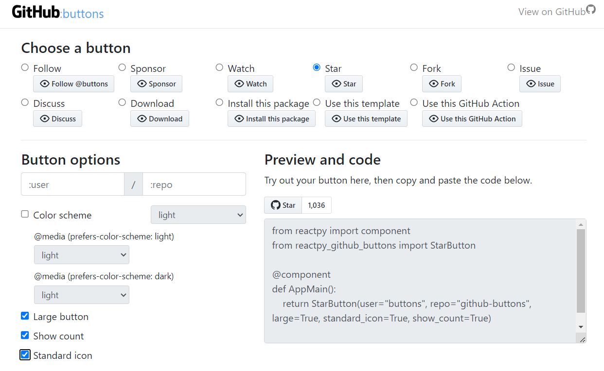

## reactpy-github-buttons


 Minimal [ReactPy] wrapper for [github-buttons].

## Usage

    pip install reactpy-github-buttons


## Examples

Several examples of usage are in the *./examples* folder.

### Minimal

*./examples/single.py*
```
from reactpy import component, html, run
from reactpy_github_buttons import StarButton

@component
def AppMain():
    return StarButton(user='reactive-python', repo='reactpy')

if __name__ == "__main__":
    run(AppMain)
```

### With Color Scheme

*./examples/color_scheme.py*
```
from reactpy import component, html, run
from reactpy_github_buttons import StarButton, make_color_scheme, ColorScheme

@component
def AppMain():
    return StarButton(user='reactive-python', repo='reactpy',
        show_count=True,
        color_scheme=make_color_scheme(
            no_preference=ColorScheme.LIGHT_HIGH_CONTRAST,
            light=ColorScheme.LIGHT,
            dark=ColorScheme.DARK_HIGH_CONTRAST,
        )
    )

if __name__ == "__main__":
    run(AppMain)
```

### Buttons Playground

The [Buttons Playground](https://buttons.github.io/) application has been implemented 
as a RectPy demonstrator.

    python -m examples.button_playground


## Building

    poetry install --no-root

    cd js
    npm install
    npm run build

## Testing

    playwright install

*Then:*

    pytest 

*or:*

    pytest --headed

## Publish 

    rm -rf dist && poetry build
    poetry publish

Or publish to local repo

    poetry publish -r pypicloud


[github-buttons]: https://github.com/buttons/github-buttons
[ReactPy]: https://github.com/reactive-python/reactpy